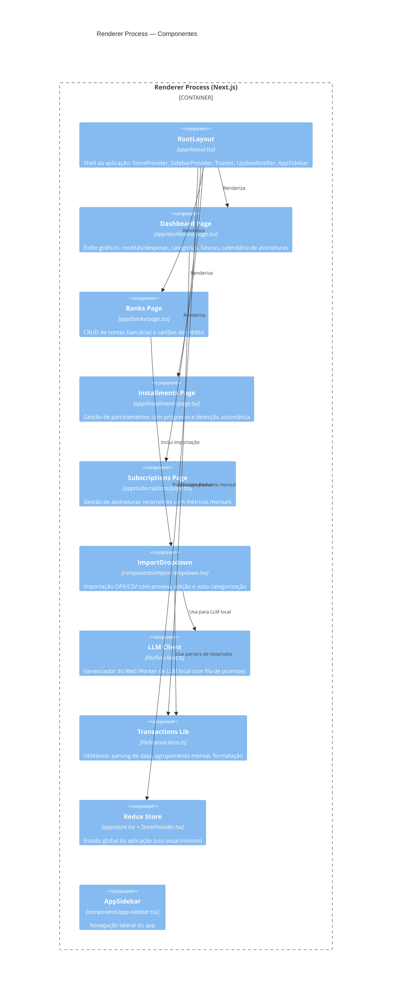
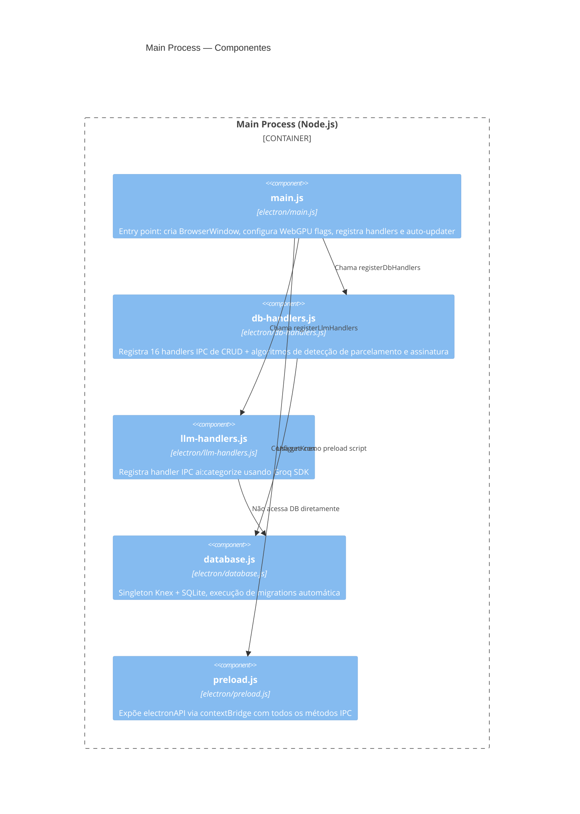

# C4 — Componentes (Nível 3) — Finapp

> Gerado pelo reversa-architect em 2026-05-02

---

## Renderer Process — Componentes

```mermaid
C4Component
    title Renderer Process — Componentes

    Container_Boundary(renderer, "Renderer Process (Next.js)") {

        Component(layout, "RootLayout", "app/layout.tsx", "Shell da aplicação: StoreProvider, SidebarProvider, Toaster, UpdateNotifier, AppSidebar")

        Component(dashboard, "Dashboard Page", "app/dashboard/page.tsx", "Exibe gráficos: receitas/despesas, categorias, faturas, calendário de assinaturas")

        Component(banks, "Banks Page", "app/banks/page.tsx", "CRUD de contas bancárias e cartões de crédito")

        Component(installments, "Installments Page", "app/installments/page.tsx", "Gestão de parcelamentos com progresso e detecção automática")

        Component(subscriptions, "Subscriptions Page", "app/subscriptions/page.tsx", "Gestão de assinaturas recorrentes com métricas mensais")

        Component(importcomp, "ImportDropdown", "components/import-dropdown.tsx", "Importação OFX/CSV com preview, edição e auto-categorização")

        Component(llmclient, "LLM Client", "lib/llm-client.ts", "Gerenciador do Web Worker de LLM local com fila de promises")

        Component(txlib, "Transactions Lib", "lib/transactions.ts", "Utilitários: parsing de data, agrupamento mensal, formatação")

        Component(store, "Redux Store", "app/store.tsx + StoreProvider.tsx", "Estado global da aplicação (uso atual mínimo)")

        Component(sidebar, "AppSidebar", "components/app-sidebar.tsx", "Navegação lateral do app")

    }

    Rel(layout, dashboard, "Renderiza")
    Rel(layout, banks, "Renderiza")
    Rel(layout, installments, "Renderiza")
    Rel(layout, subscriptions, "Renderiza")
    Rel(layout, store, "Provê store Redux")
    Rel(dashboard, txlib, "Usa agrupamento mensal")
    Rel(banks, importcomp, "Inclui importação")
    Rel(importcomp, llmclient, "Usa para LLM local")
    Rel(importcomp, txlib, "Usa parsers de data/valor")
```

---

## Main Process — Componentes

```mermaid
C4Component
    title Main Process — Componentes

    Container_Boundary(main, "Main Process (Node.js)") {

        Component(mainjs, "main.js", "electron/main.js", "Entry point: cria BrowserWindow, configura WebGPU flags, registra handlers e auto-updater")

        Component(dbhandlers, "db-handlers.js", "electron/db-handlers.js", "Registra 16 handlers IPC de CRUD + algoritmos de detecção de parcelamento e assinatura")

        Component(llmhandlers, "llm-handlers.js", "electron/llm-handlers.js", "Registra handler IPC ai:categorize usando Groq SDK")

        Component(database, "database.js", "electron/database.js", "Singleton Knex + SQLite, execução de migrations automática")

        Component(preload, "preload.js", "electron/preload.js", "Expõe electronAPI via contextBridge com todos os métodos IPC")

    }

    Rel(mainjs, dbhandlers, "Chama registerDbHandlers")
    Rel(mainjs, llmhandlers, "Chama registerLlmHandlers")
    Rel(dbhandlers, database, "Usa getKnex")
    Rel(llmhandlers, database, "Não acessa DB diretamente")
    Rel(mainjs, preload, "Configura como preload script")
```
