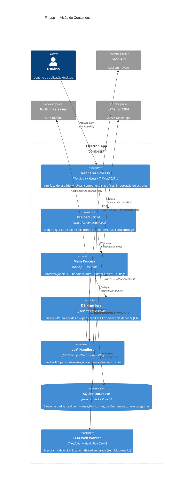

# C4 — Containers (Nível 2) — Finapp

> Gerado pelo reversa-architect em 2026-05-02

```mermaid
C4Container
    title Finapp — Visão de Containers

    Person(user, "Usuário", "Usuário da aplicação desktop")

    Container_Boundary(electron, "Electron App") {

        Container(renderer, "Renderer Process", "Next.js 14 + React + Tailwind CSS 4", "Interface do usuário: páginas, componentes, gráficos, importação de extratos")

        Container(preload, "Preload Script", "JavaScript (contextBridge)", "Bridge segura que expõe electronAPI ao renderer via contextBridge")

        Container(main, "Main Process", "Node.js + Electron", "Coordena janela, IPC handlers, auto-updater e WebGPU flags")

        Container(dbhandlers, "DB Handlers", "JavaScript (ipcMain)", "Handlers IPC para todas as operações CRUD no banco de dados SQLite")

        Container(llmhandlers, "LLM Handlers", "JavaScript (ipcMain + Groq SDK)", "Handler IPC para categorização de transações via Groq API")

        ContainerDb(sqlite, "SQLite Database", "better-sqlite3 + Knex.js", "Banco de dados local com transações, contas, cartões, assinaturas e categorias")

        Container(worker, "LLM Web Worker", "TypeScript + MediaPipe GenAI", "Executa modelo LLM local em thread separada (sem bloquear UI)")

    }

    System_Ext(groq, "Groq API", "LLM em nuvem")
    System_Ext(github, "GitHub Releases", "Auto-update")
    System_Ext(cdn, "jsDelivr CDN", "WASM MediaPipe")

    Rel(user, renderer, "Interage com", "Desktop GUI")
    Rel(renderer, preload, "Chama", "window.electronAPI.*")
    Rel(preload, main, "IPC invoke", "ipcRenderer.invoke")
    Rel(main, dbhandlers, "Delega", "registerDbHandlers")
    Rel(main, llmhandlers, "Delega", "registerLlmHandlers")
    Rel(dbhandlers, sqlite, "Lê/Escreve", "Knex.js queries")
    Rel(llmhandlers, groq, "POST", "HTTPS/REST — envia transações")
    Rel(renderer, worker, "Mensagens", "postMessage (Web Worker API)")
    Rel(worker, cdn, "GET", "HTTPS — WASM download")
    Rel(main, github, "HTTPS", "Verificação de atualizações")
```
