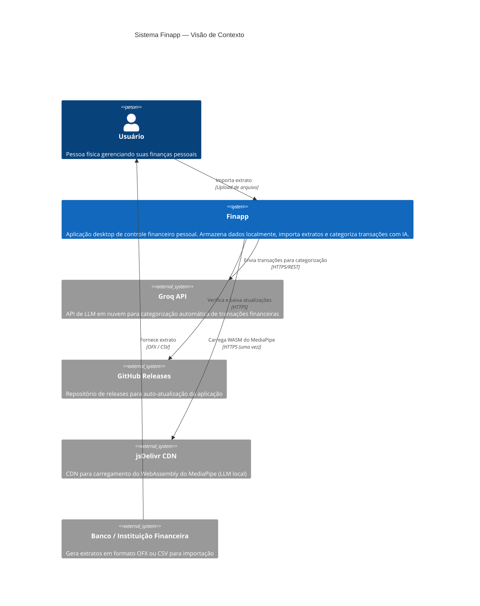

# C4 — Contexto (Nível 1) — Finapp

> Gerado pelo reversa-architect em 2026-05-02

**Notas:**
- 🟢 O Finapp não possui backend próprio — é 100% local
- 🟢 A comunicação com Groq inclui dados financeiros (descrição das transações) — risco de privacidade
- 🟡 jsDelivr é carregado apenas uma vez para habilitar o LLM local (pode ser cacheado pelo browser)
- 🟡 Google Charts Loader também está presente no `<head>` — integração não confirmada em uso ativo
