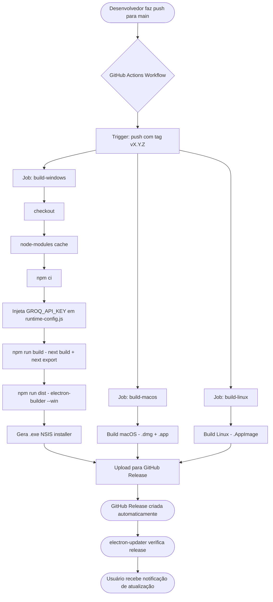

# Deployment — Finapp

> Gerado pelo reversa-architect em 2026-05-02
> Fonte: `package.json`, `.github/workflows/`, `electron-builder.yml`
> `doc_level: detalhado`

---

## Fluxo de Build e Distribuição



---

## Plataformas de Distribuição

| Plataforma | Formato | Runner GitHub Actions |
|---|---|---|
| Windows | `.exe` (NSIS installer) | `windows-latest` |
| macOS | `.dmg` | `macos-latest` |
| Linux | `.AppImage` | `ubuntu-latest` |

---

## Configuração electron-builder

| Propriedade | Valor | Fonte |
|---|---|---|
| `appId` | 🟡 INFERIDO — `com.fiinances.finapp` | `package.json` / `electron-builder.yml` |
| `productName` | `Finapp` | `package.json:name` |
| `files` | `out/**`, `electron/**`, etc. | `package.json:build.files` |
| `publish.provider` | `github` | `package.json` |
| `autoUpdater` | `electron-updater` | `electron/main.js` |

---

## Injeção de Variável de Ambiente em Produção

```
CI Secret: GROQ_API_KEY
       ↓
scripts/generate-config.js
       ↓
electron/runtime-config.js (gerado em runtime no build)
       ↓
electron/llm-handlers.js: process.env.GROQ_API_KEY (via runtime-config)
```

🟢 A API key nunca é commitada — injetada apenas na fase de build do CI.

---

## Ambiente de Desenvolvimento

| Comando | Descrição |
|---|---|
| `npm run dev` | `concurrently`: Next.js dev server (3000) + Electron |
| `npm run build` | `next build` → `next export` → pasta `out/` |
| `npm run dist` | `electron-builder` — gera instalador para a plataforma atual |
| `npm run postinstall` | `electron-rebuild` — recompila `better-sqlite3` para a versão Electron |

---

## Notas de Infraestrutura

- 🟢 **Não há servidor de backend** — app 100% local
- 🟢 **Auto-update via GitHub Releases** — sem custo de infraestrutura própria
- 🟡 **A Groq API key é necessária apenas para categorização** — app funciona sem ela
- 🔴 **LACUNA** — Não há mecanismo de backup do banco SQLite (`finapp.db`)
- 🔴 **LACUNA** — Não há processo de migração de dados entre versões (apenas migrations de schema)
