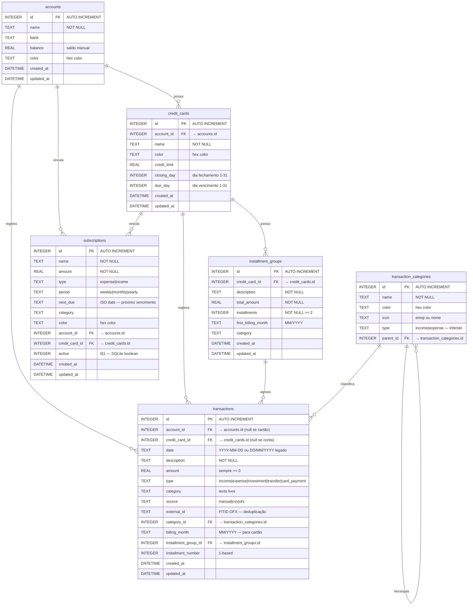

# ERD Completo — Finapp

> Gerado pelo reversa-architect em 2026-05-02
> Fonte: `data-dictionary.md`, `electron/db-handlers.js`, `app/types/electron.d.ts`

---

## Relacionamentos Detalhados

| Origem | Destino | Cardinalidade | Tipo | Confiança |
|---|---|---|---|---|
| `accounts` | `credit_cards` | 1:N | FK | 🟢 |
| `accounts` | `transactions` | 1:N | FK opcional | 🟢 |
| `accounts` | `subscriptions` | 1:N | FK opcional | 🟢 |
| `credit_cards` | `transactions` | 1:N | FK opcional | 🟢 |
| `credit_cards` | `subscriptions` | 1:N | FK opcional | 🟢 |
| `credit_cards` | `installment_groups` | 1:N | FK | 🟢 |
| `installment_groups` | `transactions` | 1:N | FK opcional (unlink no delete) | 🟢 |
| `transaction_categories` | `transactions` | 1:N | FK opcional | 🟢 |
| `transaction_categories` | `transaction_categories` | 1:N auto-ref | FK opcional (hierarquia) | 🟢 |

---

## Notas

- 🟢 Uma transação pertence a uma conta OU a um cartão — não a ambos
- 🟡 Constraints de FK não verificadas no DDL — podem não estar ativas (SQLite exige `PRAGMA foreign_keys = ON`)
- 🔴 LACUNA — `paid_installments` e `remaining_installments` aparecem na interface TypeScript mas podem não existir como colunas reais (calculados em runtime)
