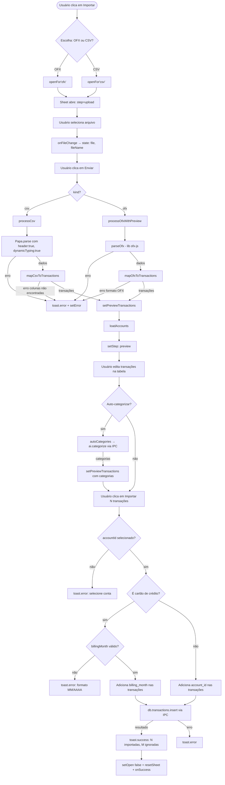
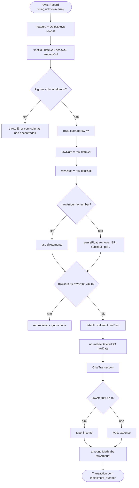
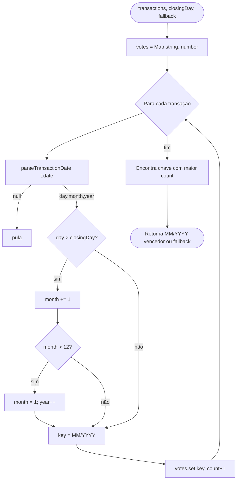
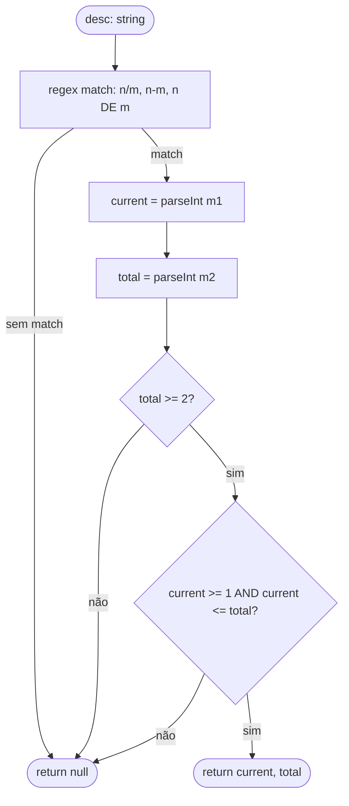

# Flowchart — Módulo: `import`

> Gerado pelo reversa-archaeologist em 2026-05-02 | `doc_level: detalhado`

---

## Fluxo geral de importação (OFX e CSV)

---

## Flowchart por função: `mapCsvToTransactions`

---

## Flowchart por função: `inferBillingMonth`

---

## Flowchart por função: `detectInstallment`

