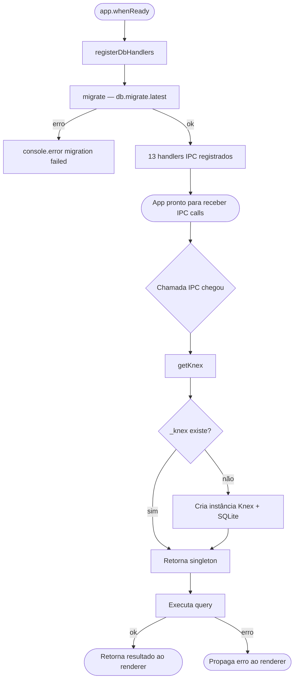
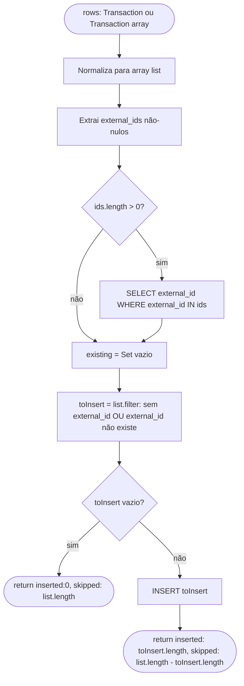
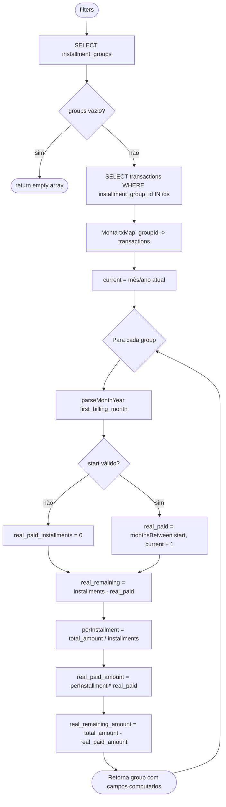
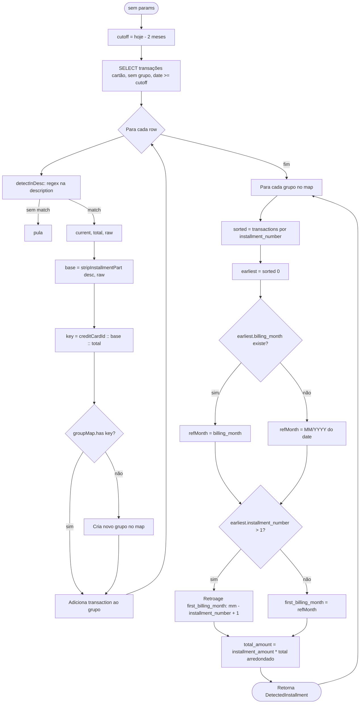

# Flowchart — Módulo: `ipc-db`

> Gerado pelo reversa-archaeologist em 2026-05-02 | `doc_level: detalhado`

---

## Fluxo geral: ciclo de vida do banco de dados

---

## Flowchart por função: `db:transactions:insert` — deduplicação

---

## Flowchart por função: `db:installmentGroups:list` — cálculo de progresso

---

## Flowchart por função: `db:installmentGroups:detect` — detecção de padrão

