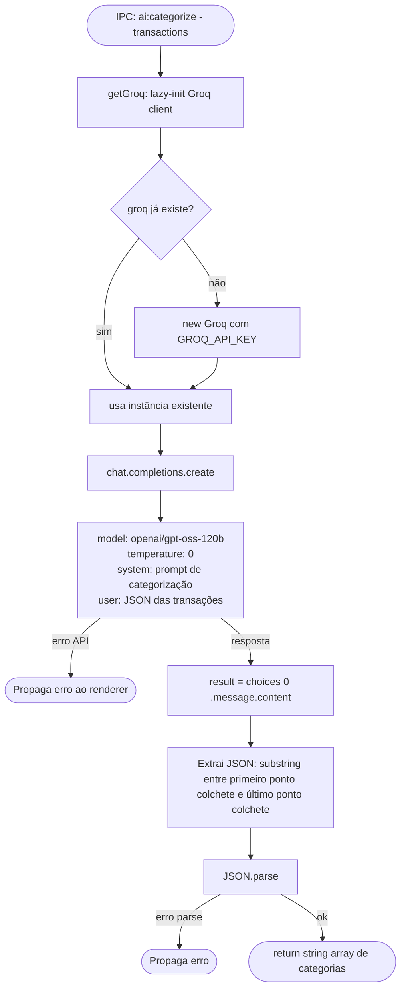
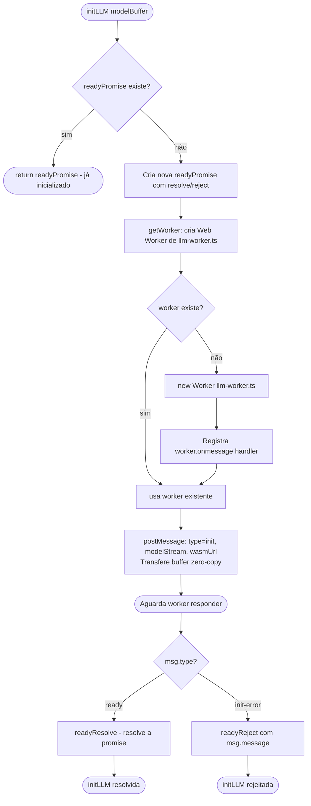
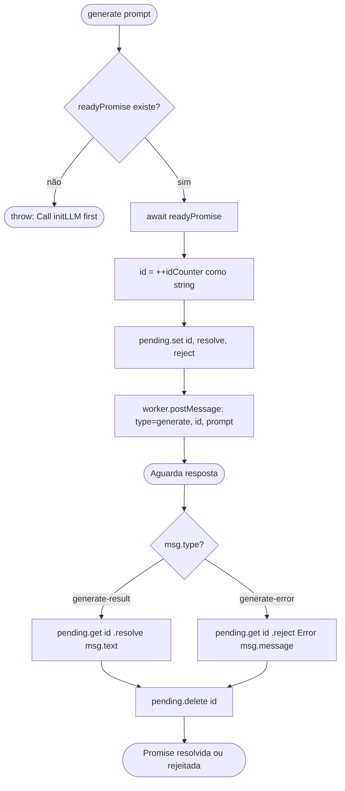
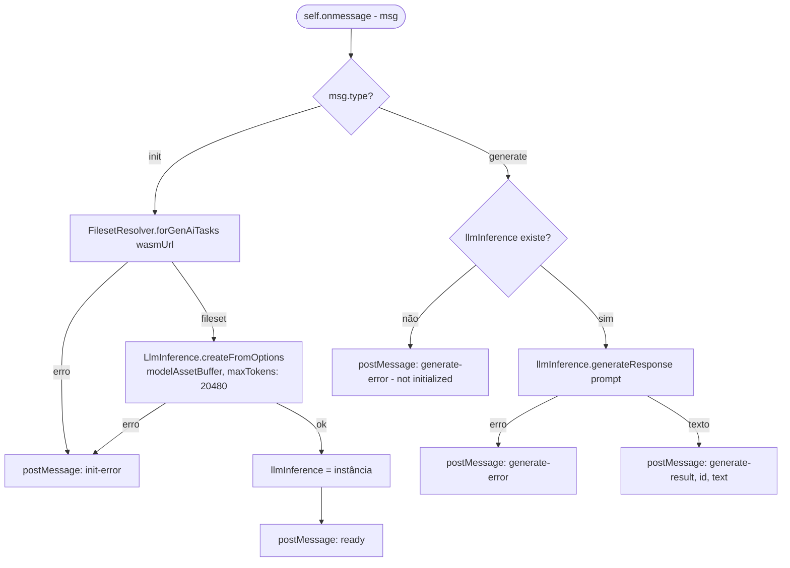

# Flowchart — Módulo: `ipc-llm`

> Gerado pelo reversa-archaeologist em 2026-05-02 | `doc_level: detalhado`

---

## Fluxo: categorização via Groq API (processo principal)

---

## Fluxo: LLM local via MediaPipe Web Worker

### Inicialização

### Geração de texto

### Worker interno (llm-worker.ts)

