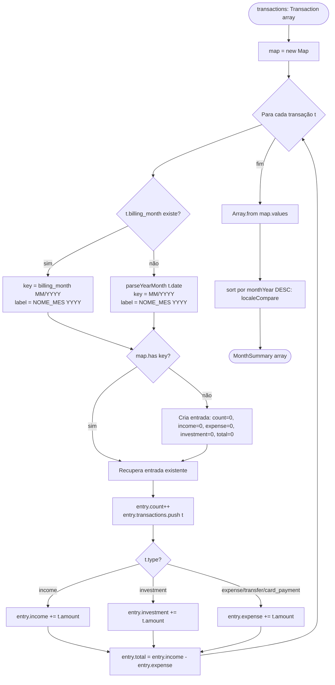
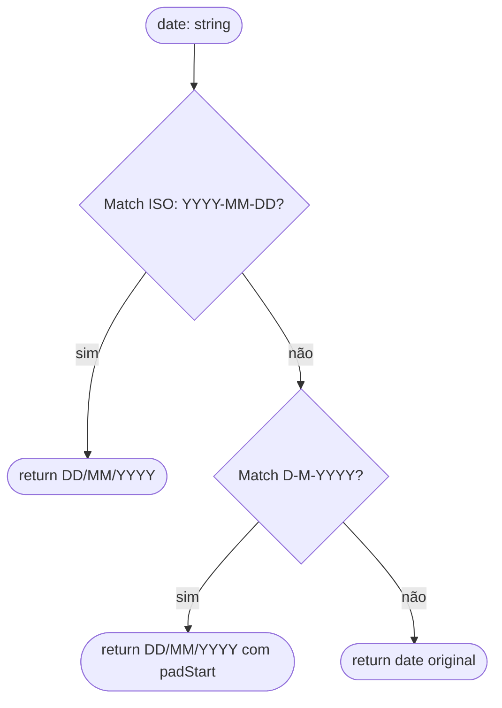
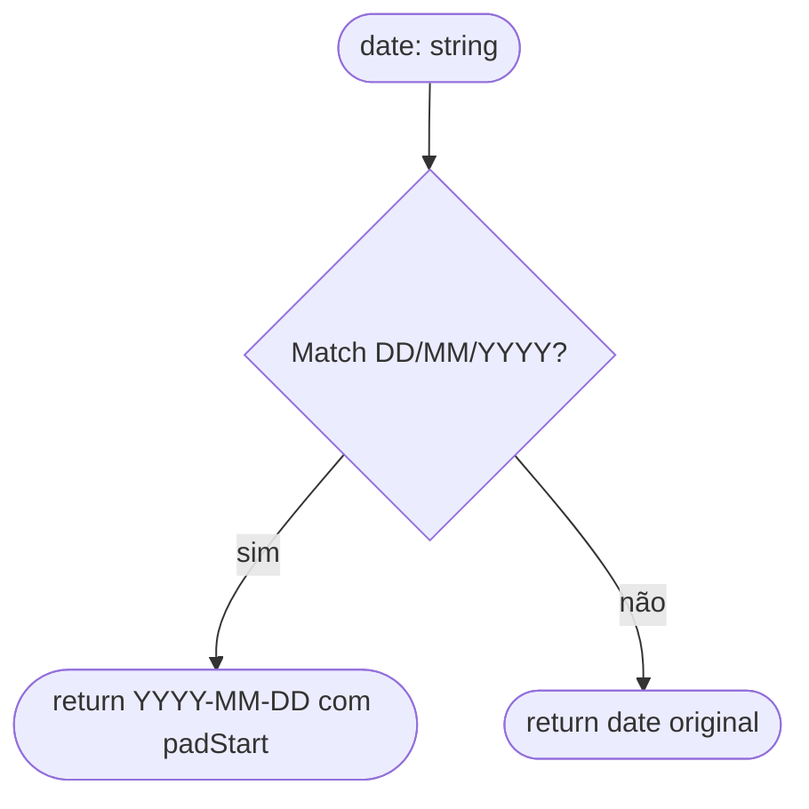
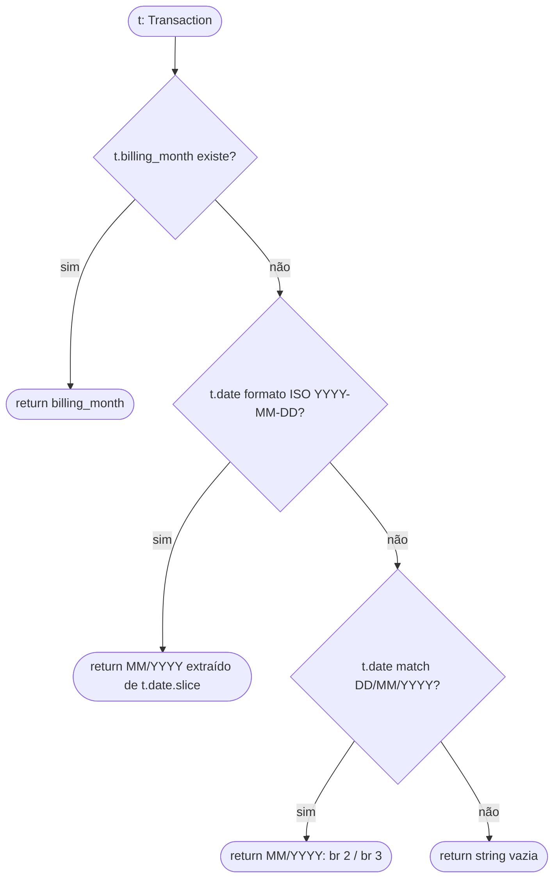

# Flowchart — Módulo: `transactions`

> Gerado pelo reversa-archaeologist em 2026-05-02 | `doc_level: detalhado`

---

## Fluxo: `buildSummaries` — agrupamento mensal

---

## Flowchart por função: `formatDate` — normalização de data para exibição

---

## Flowchart por função: `parseDateToISO` — DD/MM/YYYY → YYYY-MM-DD

---

## Flowchart por função: `txBillingMonth` — extrai mês de cobrança

