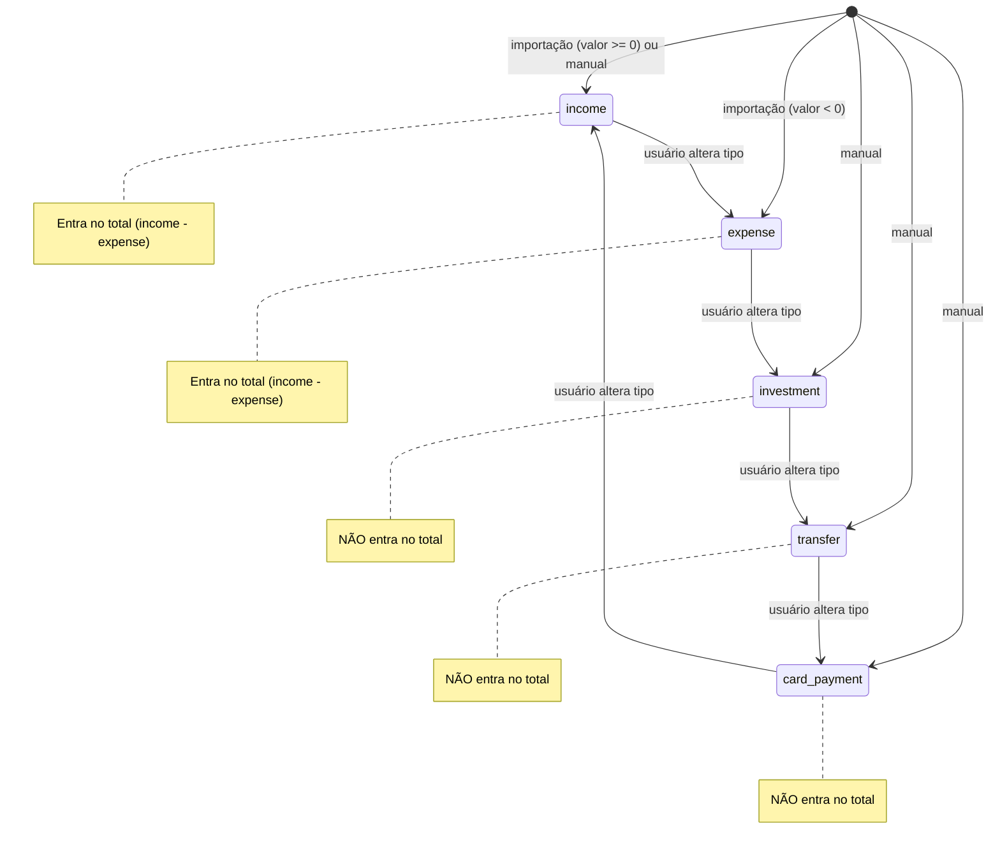
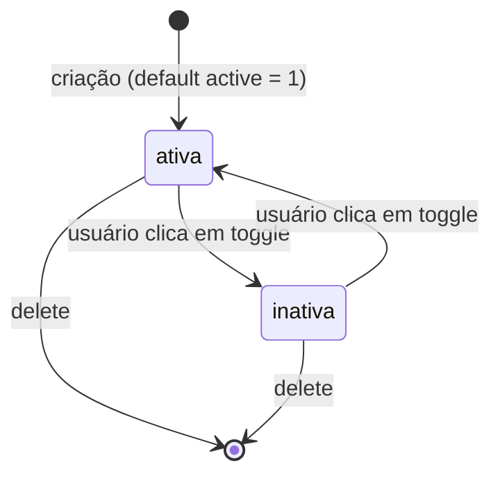
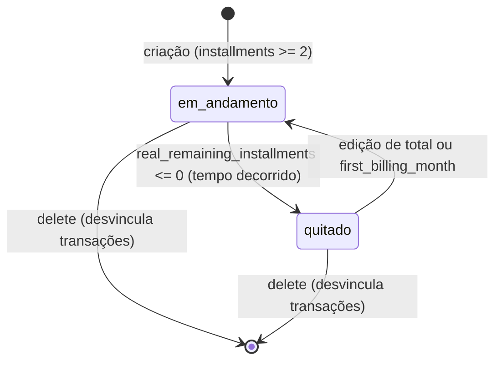
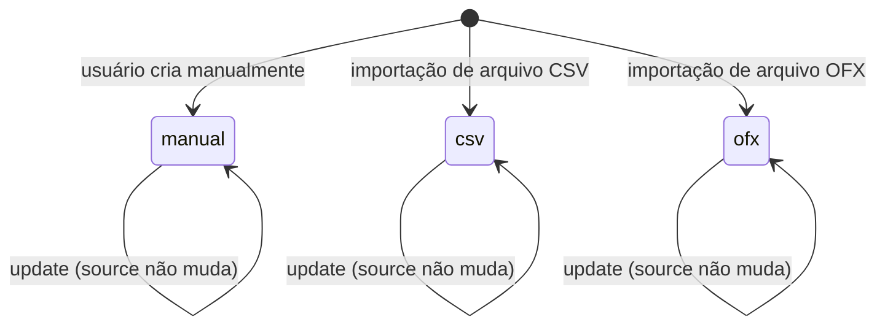
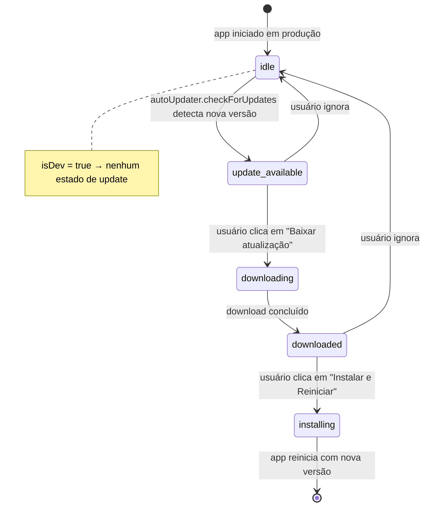

# Máquinas de Estado — Finapp

> Gerado pelo reversa-detective em 2026-05-02

---

## Entidade: `Transaction` — campo `type`

O tipo de uma transação **não muda** após a criação (exceto edição manual pelo usuário).
Durante a importação, o usuário pode ciclar pelo botão de tipo: `income → expense → investment → transfer → card_payment → income`.

**Regra de ciclo (import preview):** 🟢 CONFIRMADO — `next[t.type]` em `import-dropdown.tsx:618`

---

## Entidade: `Subscription` — campo `active`

**Notas:**
- 🟢 `active` é INTEGER (`0 | 1`) — SQLite não tem boolean nativo
- 🟢 Assinaturas inativas **não entram** nos totais mensais
- 🔴 **LACUNA** — Não há estado `vencida` ou `suspensa` diferenciado. `next_due` não altera automaticamente o `active`.

---

## Entidade: `InstallmentGroup` — campo `real_remaining_installments` (computado)

O grupo de parcelamento não tem campo `status` explícito. O estado é derivado de `real_remaining_installments`.

**Notas:**
- 🟢 `quitado` = estado visual (opacity-50 + ícone CheckCircle2) quando `remaining === 0`
- 🟡 **INFERIDO** — A transição para `quitado` é automática e baseada apenas em tempo decorrido, sem confirmação de pagamento real.

---

## Entidade: `Transaction` — campo `source` (origem)

**Nota:** 🟡 **INFERIDO** — `source` não é alterado após a criação. Não há lógica explícita que impeça a alteração, mas a UI de edição não expõe esse campo.

---

## Entidade: Atualização automática do App

**Notas:**
- 🟢 `autoDownload: false` — usuário deve confirmar o download
- 🟢 `autoInstallOnAppQuit: false` — usuário deve confirmar a instalação
